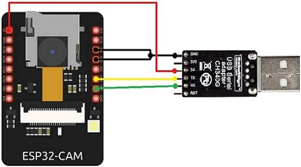

# ESP32-CAM-Video-Recorder-junior
Простая быстрая версия кода для платы ESP32-CAM

ESP32-CAM-Video-Recorder-junior

  Данная программа рекордер Motion-Jpeg видео на SD-Card для платы ESP32-CAM.
  
  В программе реализован простой Web-интерфейс, потоковая передача MJPEG, запись на карту.

## 
v10 - fast and just one version

- default is no internet, and record at SVGA at 25 fps, quality 10, and series of 30 minute videos
- add IncludeInternet to 1, and put in your ssid and password, to get live streaming
- add switches to pin 12 and 13, if you want to stop recording, or switch to another configuration -- no software changes required
- if you ground pin 12, recording will stop
- if you ground pin 13, the next video will be UXGA 6 fps, quality 10, 30 minutes -- or change in the code if you like
- old files in the /old folder

## 

  Update:  I added some complexity.
     Connect Pin 12 to GND to stop a video -- no dead videos -- and prevent recording.
     Release Pin 12 and it will record forever.

  Compile Time Parameters
    7 - SVGA(800x600 @ 24 fps), 
    5 - CIF(400x296 @ 50 fps)
   
