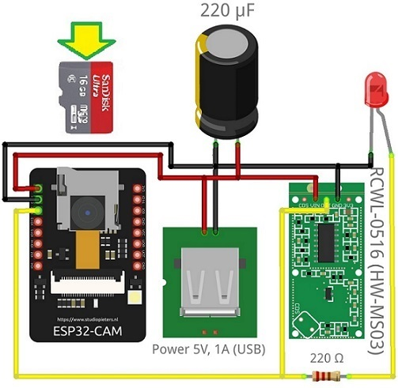

# ESP32-CAM-Video-Recorder-junior
 Проект видео/ловушка на базе платы AI-Thinker ESP32-CAM с видео-чипом OV2640, с трансляцией видео/потока(MJPEG по HTTP) по Wi-Fi.
 Версия 11.0 с доплеровским датчиком движения на модуле RCWL-0516 (аналог HW-MS03).

 Данный код разработан для ID Arduino ver. 1.8.10(и выше), платформа(менеджер плат) ESP32 ver. 1.0.4, необходимые установки для ESP32-CAM: 
    - Плата: "ESP32 Wrover Module" 
    - Схема разделов: "Huge APP (3MB No OTA)"

## Пины: 
 GPIO12 - сигнальный для датчика движения: "Высокий уровень" - движение, "Низкий уровень" - нет движения. Подробности см. в "Схеме проекта".

## Схема включения:

## Программирование платы ESP-32 Cam:

## Ссылки на источники:
    - Постоянный репозиторий проекта:
      https://github.com/AEmelyanov757/ESP32-CAM-Video-Recorder-junior.git
    - Мануалы разработчиков чипа, платы, платформы:
      https://docs.espressif.com/projects/esp-idf/en/latest/index.html - интерактивный справочник по ESP32 от компании Espressif.
      https://wiki.ai-thinker.com/esp32-cam - интерактивный справочник по ESP32-CAM от компании AI-Thinker (китайский язык).
      https://www.arduino.cc/reference/en/ - интерактивный справочник по Arduino от Arduino AG.
    - Cерия статей от Руи Сантос (Rui Santos) и компании студентов про основы программирования ESP32-CAM в среде Arduino:
      https://randomnerdtutorials.com/esp8266-pinout-reference-gpios/ - про порты вводы/вывода.
      https://randomnerdtutorials.com/esp32-touch-pins-arduino-ide/ - про особенность сенсорных кнопок ESP32.
      https://makeradvisor.com/esp32-cam-ov2640-camera/ - вводная статья о ESP32-CAM.
      https://randomnerdtutorials.com/esp32-cam-video-streaming-web-server-camera-home-assistant/ - организация Wi-Fi видое стриминга.
      https://randomnerdtutorials.com/esp32-cam-video-streaming-face-recognition-arduino-ide/ - стриминг и распознование лиц.
      https://randomnerdtutorials.com/esp32-cam-take-photo-save-microsd-card/ - сохранение фото на SD-карты, преодоление проблемы "4 Гбайт".
    - Полезные репозитории кода на GitHub по ESP32-CAM:
      https://github.com/espressif/esp32-camera - репозиторий от Espressif.
      https://github.com/donny681/ESP32_CAMERA_QR - репозиторий кода распознования QR-кода (можно организовать чтение имени и пароля Wi-Fi "на лету").
      https://github.com/raphaelbs/esp32-cam-ai-thinker - репозиторий кода Wi-Fi стрим камеры.
      https://github.com/ArduCAM/ArduCAM_ESP32S_UNO - бибилиотека Arduino Camera, адаптированный для ESP32. Есть пример кода записи видео (320x240) на SD-карту.
      https://github.com/dproldan/Esp32AutoCamera - репозиторий кода Wi-Fi стрим камеры.
      https://github.com/tsaarni/esp32-micropython-webcam - репозиторий кода Wi-Fi стрим камеры на MicroPython (первый шаг в сторону OpenMV).
      https://github.com/openmv/openmv - репозиторий кода библиотеки машинного зрения OpenMV. Требуется произвести адаптацию быстрых математически функций. 
      https://github.com/jameszah/ESP32-CAM-Video-Recorder.git
      https://github.com/jameszah/ESP32-CAM-Video-Recorder-junior.git
